# Evidências da POC

As capturas abaixo foram obtidas durante a execução real da POC.

## Estado da plataforma

O `make status` confirma os containers de CI, os dois nodes Kubernetes, os pods da plataforma, Ingress, HPA, releases Helm e os checks de saúde. A visão do namespace `poc` complementa a validação com os recursos gerenciados pela aplicação.

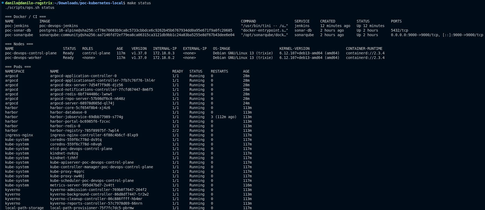

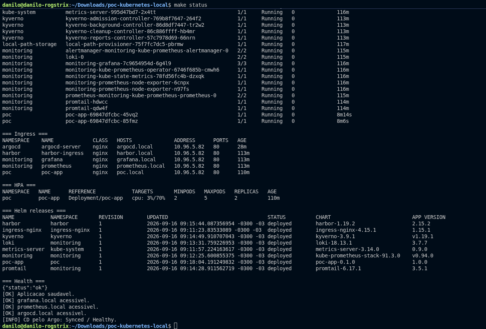

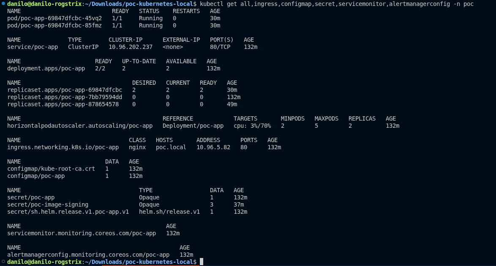

## Pipeline Jenkins

A build `#2` concluiu todos os stages, incluindo testes, análises de segurança, publicação, assinatura, deploy GitOps e smoke test.

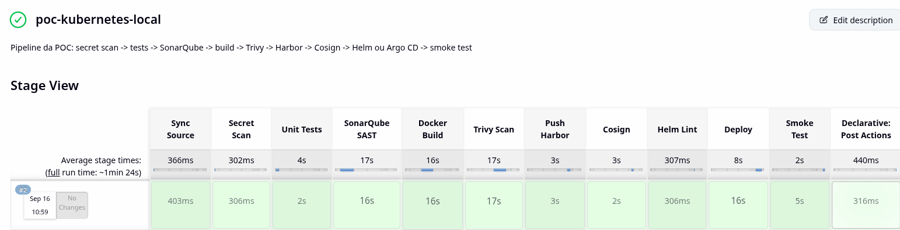

## Qualidade no SonarQube

O Quality Gate foi aprovado, com notas A em segurança e confiabilidade, cobertura de 98% e duplicação de 0%.

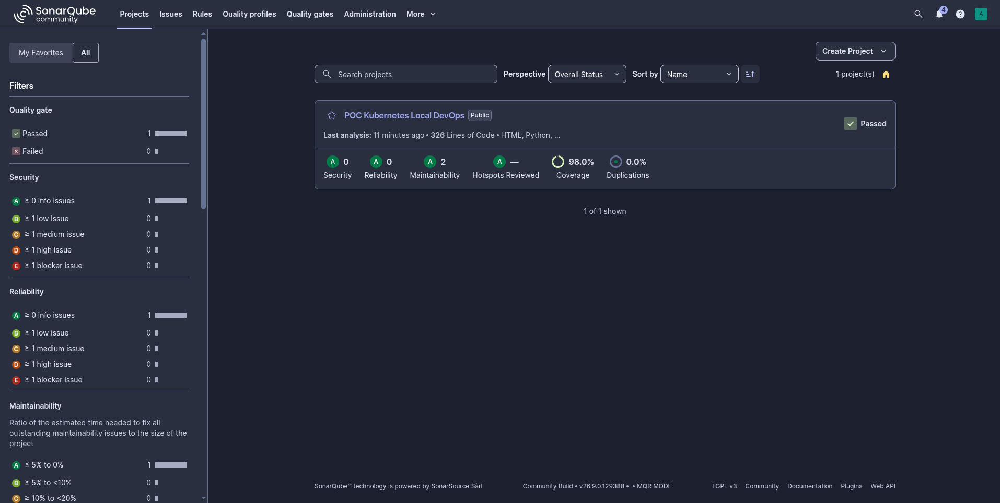

## Scan da imagem com Trivy

O pipeline usa `--exit-code 1` para bloquear vulnerabilidades `HIGH` e `CRITICAL`. O relatório da imagem `harbor.local/poc/poc-app:1.0.2` terminou sem findings de segurança.

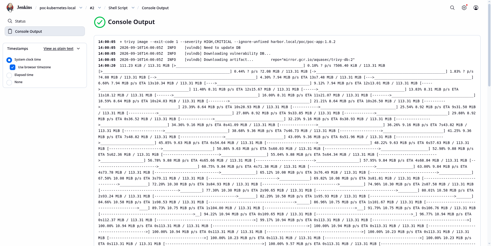

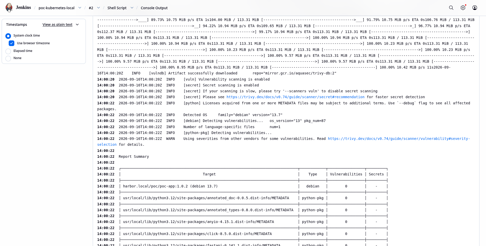

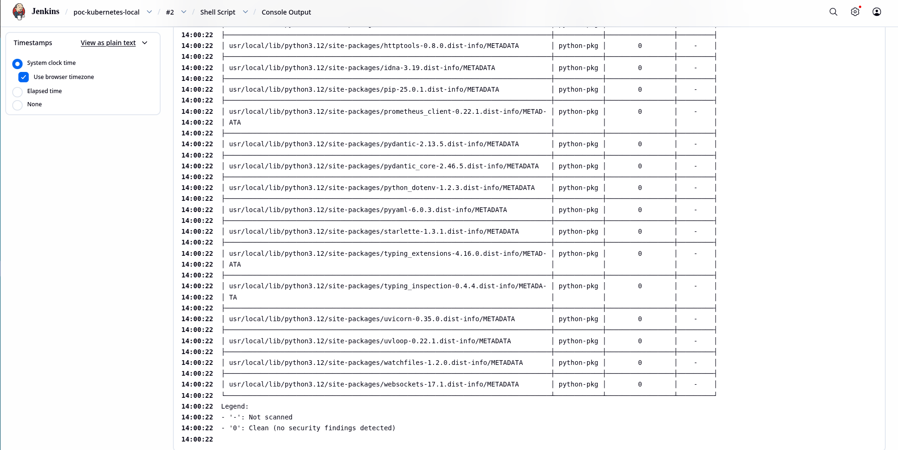

## Imagens no Harbor

O repositório `poc/poc-app` contém tags versionadas, cada uma associada ao seu digest e marcada como assinada.

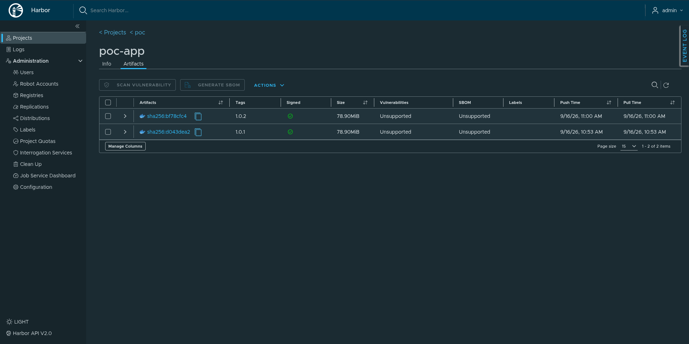

## Assinatura com Cosign

A assinatura foi publicada no Harbor e verificada pelo digest com a chave pública. A verificação do transparency log é feita offline nesta POC local; em produção, a recomendação é integrar Rekor ou mecanismo equivalente.

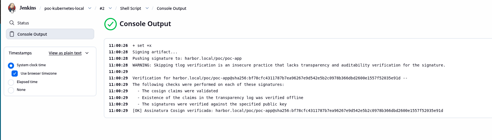

## Observabilidade no Grafana

Os dashboards cobrem aplicação, pods, nodes, Prometheus e Alertmanager. O dashboard `POC App` reúne disponibilidade, targets, requisições, CPU, memória e logs.

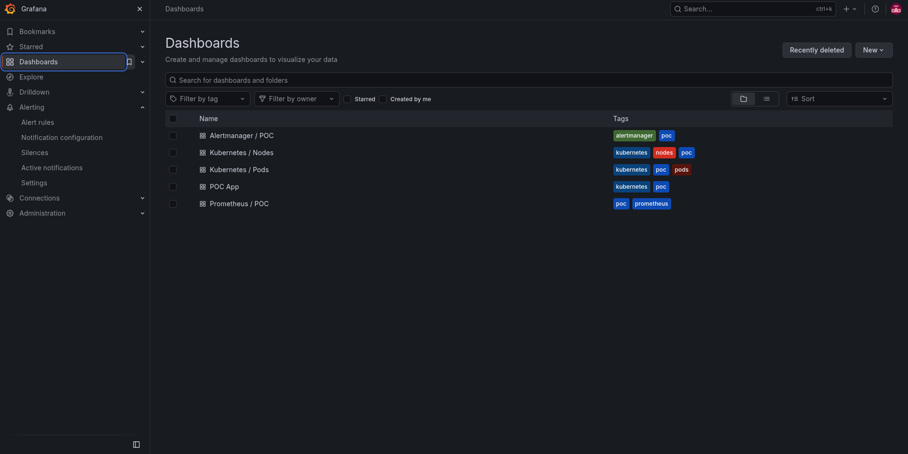

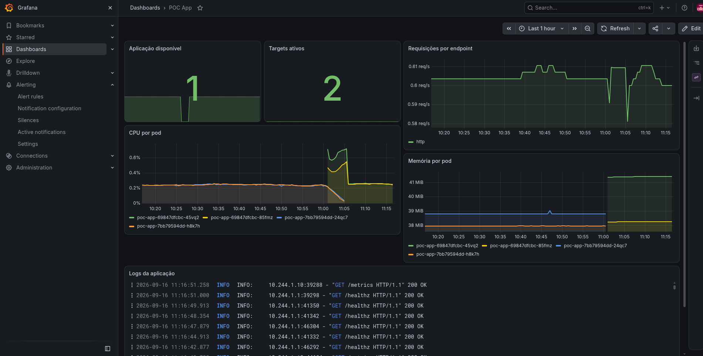

## Logs no Loki

O Grafana Explore consulta `{namespace="poc"}` e apresenta o volume e as linhas de log dos pods, incluindo chamadas a `/healthz` e `/metrics` com resposta HTTP 200.

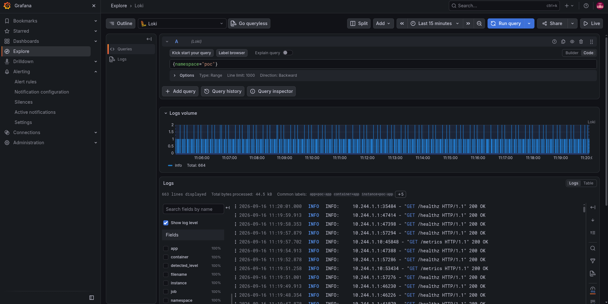

## Política com Kyverno

O admission webhook bloqueou a criação de `nginx:latest` pela policy `disallow-latest-tag`, exigindo uma versão explícita ou digest.

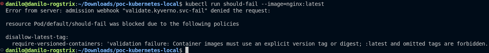

## Aplicação e endpoints

A página principal identifica o ambiente `local`, a versão implantada `1.0.2` e a plataforma Kubernetes. A documentação OpenAPI apresenta os endpoints disponíveis.

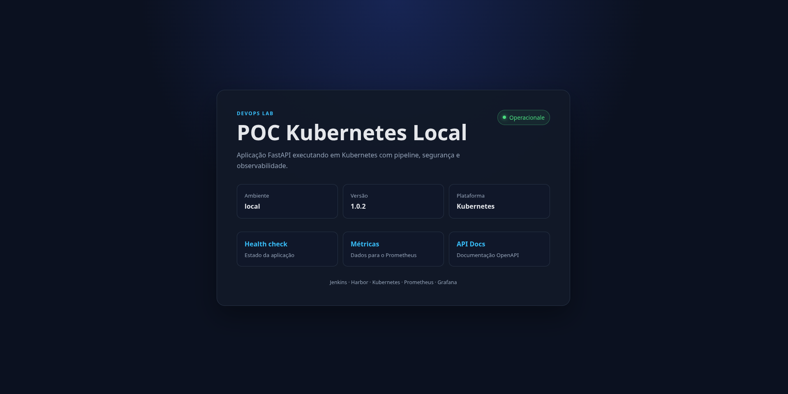

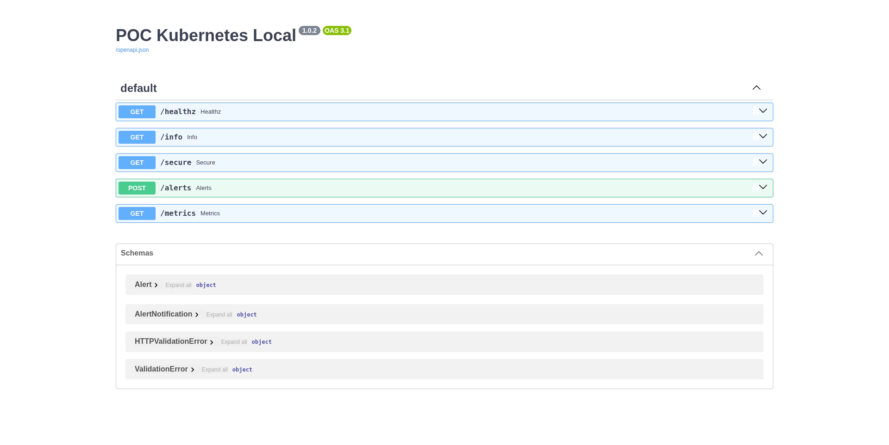

## HPA e métricas

O HPA mantém duas réplicas, com limite de cinco e meta de 70% de CPU. As métricas mostram o consumo dos pods e dos dois nodes.

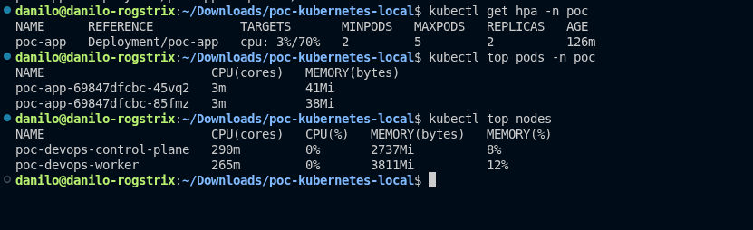

## Scan de secrets

O Trivy verifica o workspace com o scanner de secrets e `--exit-code 1`. Apenas `.git` e `.venv`, que são diretórios gerados, ficam fora da varredura.

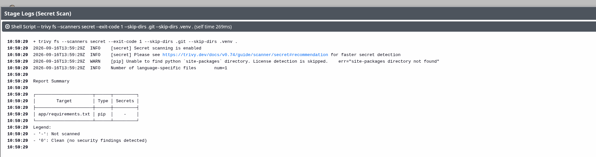

## Health check

O endpoint `/healthz` respondeu HTTP 200 com `{"status":"ok"}` por meio do Ingress.

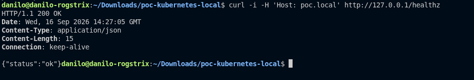

## Argo CD

A aplicação `poc-app` permaneceu `Synced` e `Healthy`, com todos os recursos gerenciados após o deploy.

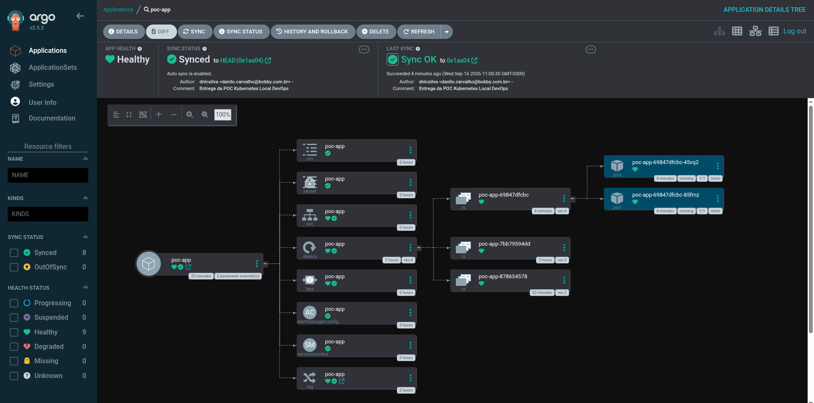
